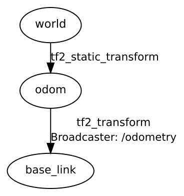

# Robotics Project 1 - A.Y. 2021-2022
First project of the Robotics Course (Perception, Localization and Mapping for Mobile Robots) at Politecnico di Milano.  
Description of the project available [here](docs/Project1.pdf).

## Team members
- Pietro Mello Rella
- Matteo Pierini

## ROS assets
### Nodes
- **odometry** ([*odometry.cpp*](src/odometry.cpp))  
    Handles the odometry computation from the encoder data (topic */wheel_states*) and it publishes it on the */odom* topic. It broadcasts the TF for the robot base link. It also publishes the robot local velocity on the */cmd_vel* topic.
- **wheel_pub** ([*wheel_publisher.cpp*](src/wheel_publisher.cpp))  
    Publishes the wheel speeds on the */wheels_rpm* topic, starting from the robot velocity computed by the odometry node. Each message contains the RPM values of the 4 wheels, as specified in the [Wheels_velocity.msg](msg/Wheels_velocity.msg) message definition.

### Parameters
The parameters ***x0***, ***y0*** and ***theta0*** are read at the start of the odometry node and they set the initial position for the odometry.

### Services
The ***reset_odometry*** service resets the odometry to a given pose. As specified in the [ResetOdometry.srv](srv/ResetOdometry.srv) service description, the service call must contain 3 float parameters which correspond to the values of x, y and theta of the new starting pose.

### Dynamic reconfigure
Once the odometry node is started, the parameter ***odometry_integration_method*** is exposed and it can dynamically reconfigured in order to change the odometry integration method (0 for Euler and 1 for Runge-Kutta 2nd order). The default integration method is Euler.

### TF tree
The structure of the TF tree is reported below. The identity transform from *world* to *odom* is broadcasted only once at startup, while the TF from *odom* to *base_link* is constantly updated by the odometry node.  

### Launch file
The launch file [run.launch](launch/run.launch) starts the 2 nodes (odometry and wheel_publisher) and broadcasts the static TF from *world* to *odom*. It also sets the parameters for the initial pose of the odometry to (0, 0, 0).

## Parameters tuning
The tuned robot parameters are obtained with the Python script in the [parameters_optimization](parameters_optimization/) folder and are reported in the [parameters.h](src/parameters.h) header.  
They are computed by reading from the bags (exported in csv) the ground truth robot trajectory and the wheel speeds. Then, it is defined a cost function that, given a set of robot parameters, simulates the odometry path and evaluates how much it diverges from the real trajectory. The optimal parameters are chosen as the ones that numerically minimize that cost function.
